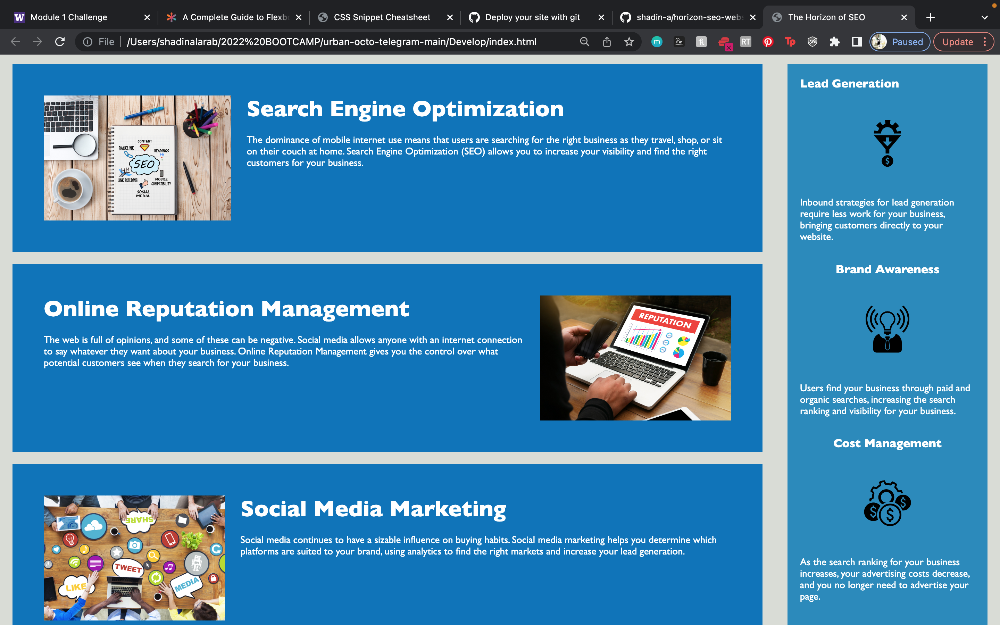

# horizon-seo-website

challenge 1/uw bootcamp/07-11-2022

In order to fulfill the requirments of assignment, we were asked to refactor original code to include comments and more succinet langugae as to bemore accesible to a broader audience. 
 
We also:
 
Refactored html code for Horiseon website to optimize SEO for the website.
 
Done by using more specific tags to represent content enclosed in the original div.
 
Comments made in the CSS stylesheet to define what is being stylized by the content. 
  Attempt made to consolidate CSS elements, however further attempts to do so comprimised website layout. 

